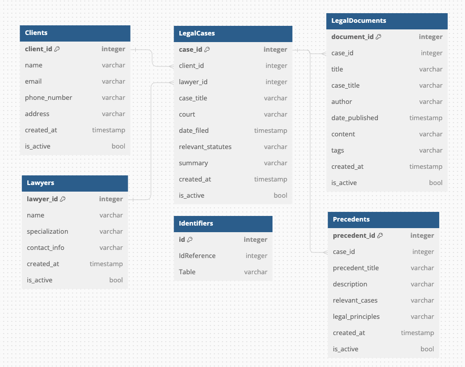

# Legal-Management-API

Legal Management API for Uniempresarial Workshop

## Database Design

Below is the database design for the Legal Management API:

<!-- Add any additional details or explanations about the database design if needed -->

## Getting Started

<!-- Add instructions on how to get started with your API -->

## API Documentation

<!-- Provide information on API endpoints, usage, etc. -->

## License

This project is licensed under the [LICENSE_NAME] - see the [LICENSE.md](LICENSE.md) file for details.
